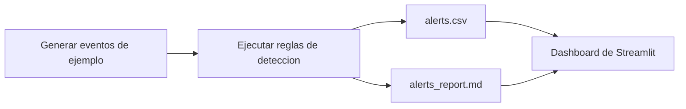

# SOC Home Lab

[Read in English](README.md)

SOC Home Lab es un proyecto de portafolio blue-team que simula un flujo SOC junior desde eventos crudos hasta evidencia lista para triage. El repositorio genera telemetria de seguridad de ejemplo, aplica reglas de deteccion, produce salidas faciles de revisar y muestra los resultados en un dashboard ligero con Streamlit.

## Lo que demuestra este proyecto

- Generacion de eventos de seguridad con actividad de inicio de sesion, cambios de privilegio, reseteos de contrasena y acceso a archivos
- Reglas de deteccion para rafagas de autenticacion fallida y cambios de privilegio riesgosos
- Artefactos de triage en formato CSV y Markdown
- Un dashboard sencillo para convertir alertas en evidencia de portafolio y material de entrevista
- Una estructura clara para que reclutadores, mentores y colaboradores entiendan rapido el proyecto

## Casos de uso de deteccion

- `R001` `high`: rafaga de logins fallidos del mismo usuario y la misma IP en una ventana de 10 minutos
- `R002` `critical`: cambio de privilegios desde una geografia no confiable

## Flujo de trabajo



## Estructura del repositorio

```text
soc-home-lab/
|-- data/
|   `-- raw_events.jsonl
|-- evidence/
|   `-- README.md
|-- output/
|   |-- alerts.csv
|   `-- alerts_report.md
|-- src/
|   |-- dashboard.py
|   |-- detect_alerts.py
|   |-- generate_sample_logs.py
|   `-- run_pipeline.py
|-- requirements.txt
|-- README.md
`-- README.es.md
```

## Inicio rapido

### macOS o Linux

```bash
python -m venv .venv
source .venv/bin/activate
pip install -r requirements.txt
python src/run_pipeline.py
streamlit run src/dashboard.py
```

### Windows PowerShell

```powershell
python -m venv .venv
.venv\\Scripts\\Activate.ps1
pip install -r requirements.txt
python src/run_pipeline.py
streamlit run src/dashboard.py
```

## Salidas

- `output/alerts.csv` contiene las alertas normalizadas para filtrado o exportacion.
- `output/alerts_report.md` contiene un resumen legible util para notas de caso o capturas de portafolio.
- `evidence/README.md` lista el paquete de capturas que conviene generar antes de publicar el proyecto.

## Por que este repo funciona bien en portafolio

- Muestra pensamiento de seguridad de punta a punta en lugar de scripts aislados.
- La logica de deteccion es legible y facil de explicar en entrevista.
- Combina salida tecnica con evidencia visual lista para presentar.
- El tamano del codigo permite revisarlo rapido, lo que ayuda a que entiendan tu trabajo sin friccion.

## Siguientes mejoras

- Agregar mapeo MITRE ATT&CK por regla
- Introducir allowlists y umbrales adaptativos
- Enriquecer alertas con contexto de IP y ownership
- Agregar mas detecciones como impossible travel, password spray y acceso sospechoso a archivos
