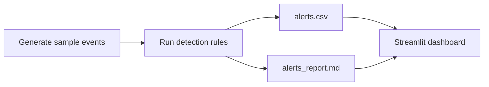

# SOC Home Lab

[Version en espanol](README.es.md)

SOC Home Lab is a compact blue-team portfolio project that simulates a junior SOC workflow from raw events to triage-ready evidence. The repository generates sample security telemetry, applies rule-based detections, produces analyst-friendly outputs, and exposes the results in a lightweight Streamlit dashboard.

## What this project demonstrates

- Security event generation with realistic login, privilege change, password reset, and file access activity
- Rule-based detections for suspicious authentication bursts and risky privilege changes
- Triage-ready artifacts in both CSV and Markdown formats
- A simple dashboard that turns alerts into portfolio evidence and interview material
- Clear project packaging that is easy for recruiters, mentors, and collaborators to review

## Detection use cases

- `R001` `high`: burst of failed logins from the same user and source IP within a 10-minute window
- `R002` `critical`: privilege change from a non-trusted geography

## Workflow



## Repository structure

```text
soc-home-lab/
|-- data/
|   `-- raw_events.jsonl
|-- evidence/
|   `-- README.md
|-- output/
|   |-- alerts.csv
|   `-- alerts_report.md
|-- src/
|   |-- dashboard.py
|   |-- detect_alerts.py
|   |-- generate_sample_logs.py
|   `-- run_pipeline.py
|-- requirements.txt
|-- README.md
`-- README.es.md
```

## Quick start

### macOS or Linux

```bash
python -m venv .venv
source .venv/bin/activate
pip install -r requirements.txt
python src/run_pipeline.py
streamlit run src/dashboard.py
```

### Windows PowerShell

```powershell
python -m venv .venv
.venv\\Scripts\\Activate.ps1
pip install -r requirements.txt
python src/run_pipeline.py
streamlit run src/dashboard.py
```

## Outputs

- `output/alerts.csv` contains the normalized alerts that an analyst could filter or export.
- `output/alerts_report.md` contains a readable summary useful for case-study notes or portfolio screenshots.
- `evidence/README.md` lists the screenshot pack that should be captured before publishing the project as portfolio evidence.

## Why this repo works as a portfolio piece

- It shows end-to-end security thinking instead of isolated scripts.
- The detection logic is readable enough to discuss in interviews.
- The repo gives both technical output and presentation-ready evidence.
- The codebase is small enough to audit quickly, which helps reviewers understand your work fast.

## Next improvements

- Add MITRE ATT&CK mapping for each rule
- Introduce allowlists and adaptive thresholds
- Enrich alerts with source IP context and ownership data
- Add more detections for impossible travel, password spray, and suspicious file access
